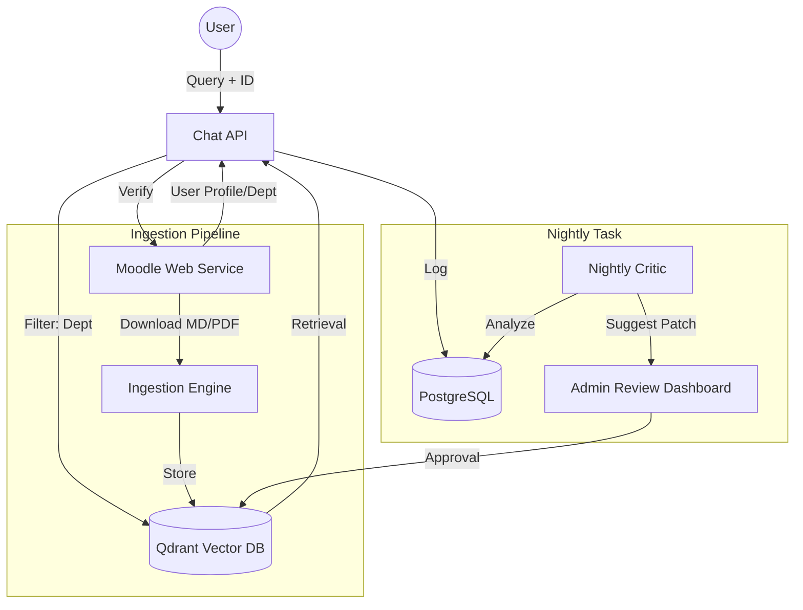

# Moodle RAG Integration Design Specification

**Date**: 2026-03-11  
**Status**: Approved (Brainstorming Complete)

## 1. Overview

This design outlines the integration of the AI-LMS-Agent with the Moodle LMS to provide personalized course recommendations, data isolation (HO/FO), and a semi-automatic evaluation loop.

## 2. Architecture & Components

### 2.1 Identity & Session Management

* **Flow**: Client attaches `moodle_user_id` and `moodle_token` to `/chat` headers.
* **Verification**: Chatbot calls Moodle API `core_user_get_users_by_field` to verify token/ID.
* **Metadata Extraction**: System retrieves "Department" (HO or FO) from the Moodle user profile "Optional" section.
* **State**: Identity and department are cached in Redis for the session duration.

### 2.2 Data Isolation (Qdrant)

* **Payload Schema**: Every Qdrant point will include `department` ("HO", "FO", or "GLOBAL") and `course_id` (optional).
* **Mandatory Filtering**: All retrieval calls (vector/hybrid) will include a strict filter on the `department` field matching the user's session.

### 2.3 Course Recommendations

* **Discovery Tool**: A new LangGraph tool `moodle_course_discovery` will:
*   **Discovery Tool**: A new LangGraph tool `moodle_course_discovery` will:
    1.  Call `core_course_get_courses` to find relevant courses.
    2.  Call `core_completion_get_course_completion_status` for the current user.
    3.  Filter out completed courses.
    4.  Return formatted markdown links to the AI assistant.

### 2.4 Intelligent User Profile & Behavior Tracking
The system builds a "Student DNA" profile in PostgreSQL/Redis to improve personalization:
*   **Behavior Tracking**: Tracks user habits (e.g., preference for concise vs. detailed answers, frequency of certain topics, preferred language).
*   **Personalized Interaction**: AI adjusts tone and complexity based on historical interactions.
*   **Response Evaluation**: Integrates **Langfuse + Ragas** to monitor faithfulness and relevance.

### 2.5 Chatbot Guardrails (Token Optimization & Safety)
*   **The "Greeting Gate"**: Router node handles simple greetings without calling Qdrant, saving tokens.
*   **Knowledge Boundary**: Bot strictly refuses to answer questions outside the Amartha Knowledge Base.

### 2.6 Zero-Frontend Admin Improvement (Langfuse)
To eliminate a custom dashboard, we use Langfuse's self-hosted interface:
*   **Annotation Queues**: Nightly Ragas audits flag poor traces into Langfuse Annotation Queues.
*   **Human-in-the-Loop**: Admins review and correct responses directly within the Langfuse UI.
*   **Knowledge Sync**: A background script pulls these "Human Corrected" updates and pushes them to Qdrant as priority patches.

### 2.7 Secure Admin Authentication (RBAC)
*   **Role-Based Access**: Access to Langfuse and the review process is restricted to Moodle `siteadmin` or `manager` roles.
*   **JWT Security**: Secure handshake between Amartha backend and Langfuse.

### 2.8 Automated Moodle Ingestion Sync
To avoid manual uploads and high token/server burden from video content:
*   **Target Source**: A dedicated Moodle course named `Knowledge_Base`.
*   **Structure**: Sections represent "Topics"; Markdown/PDF modules are the source documents.
*   **Sync Logic**:
    1.  Bot identifies the `Knowledge_Base` course ID.
    2.  Bot fetches contents and downloads Markdown/PDF files.
    3.  Chunks are tagged with Section Name (`topic`) and Course Name (`source`).
*   **Trigger**: Manual trigger by Admin or weekly Cron job.

### 2.9 Bilingual Support (Indonesian & English)
The system is designed to handle both Indonesian and English content seamlessly:
*   **Cross-Lingual Retrieval**: Using `text-embedding-3-small` allows Indonesian queries to find English HO documents.
*   **Bilingual Evaluation**: Ragas will be configured with bilingual evaluators to verify faithfulness across languages.
*   **Language Detection**: The AI Agent automatically responds in the same language used by the student.

## 3. Data Flow Diagram

## 4. Implementation Priorities

1. **Phase 1**: Moodle Identity Verification & Session Metadata.
2. **Phase 2**: Qdrant Tagging & Filtering Logic.
3. **Phase 3**: Course Recommendation Tool with Completion Filtering.
4. **Phase 4**: Nightly Audit Script & Admin Review API.

## 5. Security & Privacy

* Moodle tokens are never stored in plain text in logs.
* Strict HO/FO isolation ensures zero cross-department data leakage.
