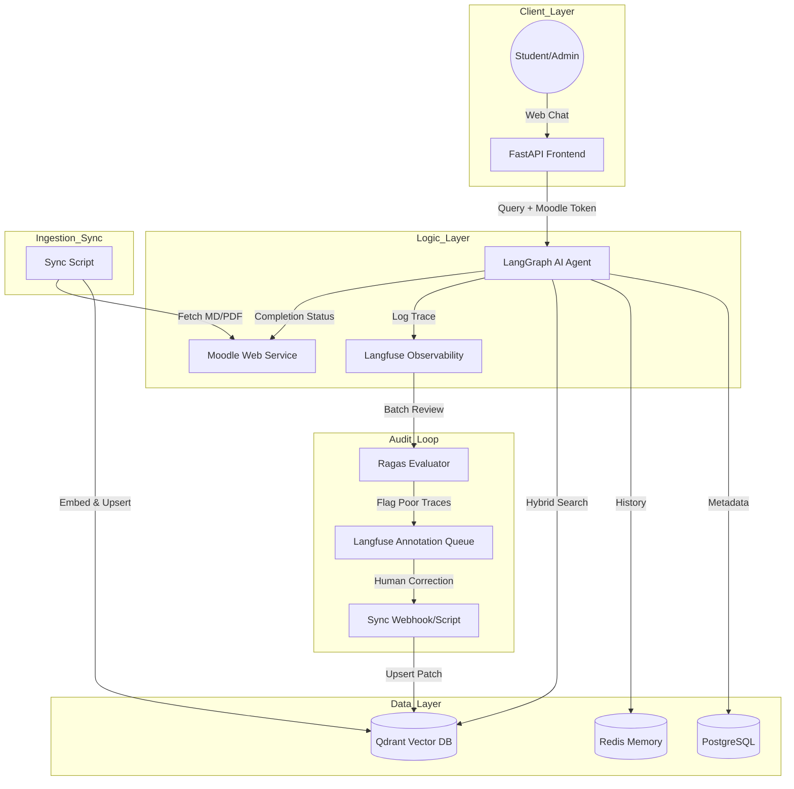

# Unified Architecture Design: Bilingual Moodle-RAG Chatbot

**Date**: 2026-03-11  
**Project**: AI-LMS-Agent (Amarthapedia)  
**Status**: Final Draft for Lead Review  

## 1. Executive Summary

This document presents the unified architecture for the Amarthapedia RAG Chatbot. The system integrates directly with Moodle to provide a personalized, bilingual (Indonesian/English) learning assistant. Key innovations include automated knowledge ingestion from Moodle, department-based data isolation (HO/FO), and a semi-automatic evaluation loop for continuous improvement.

## 2. System Architecture

### 2.1 Technical Stack

* **Runtime**: Python 3.12 (Optimized for performance and library compatibility).
* **Orchestration**: FastAPI (Backend) + LangGraph (Agentic Workflow).
* **Vector Store**: Qdrant with **Native Hybrid Search** (Dense + Sparse).
* **Database**: PostgreSQL (Metadata & Logs) + Redis (Conversation Memory).
* **Evaluation**: LangSmith (Tracing) + Ragas (Bilingual Metrics).

### 2.2 Shared Infrastructure Diagram



## 3. Core Features

### 3.1 Personalized Moodle Integration & Long-term Memory
The system uses a **Hybrid "Lazy-Persistent"** approach:
* **JIT Identity Mapping (Identity)**: Session tokens are verified against Moodle API only when a student logs in. The result (`user_id`, `department`) is cached in **Redis** for the session.
* **Persistent Student DNA (Memory)**: While identity is verified JIT to handle 10k+ users, the student's learning habits and "DNA" are saved permanently in **PostgreSQL**.
* **Optimization: Token & Performance Management**:
    * **Short-term (Sliding Window & Summary)**: Manages **what** the user is saying right now. We use a sliding window for the last 5 turns. Past that, we only keep an executive summary of the current session to save tokens.
    * **Long-term (DNA Distillation)**: Manages **who** the user is across weeks/months. We distill "Facts & Interests" (e.g., "HO employee", "Prefers concise technical answers") into a persistent profile.
    * **Memory Hierarchy**: This dual-track system ensures the bot has context without the "Token Bloat" of raw chat history.
* **Benefits**: High performance, low token cost, and professional long-term memory for active users.

### 3.2 Automated "Section-to-Topic" Ingestion
The ingestion engine creates a structured knowledge base automatically:
* **Source of Truth**: A dedicated Moodle course named `Knowledge_Base`.
* **Recursive Traversal**: Uses `core_course_get_contents` to loop through every Section and every File module.
* **Topic Mapping**: Each **Section Name** in Moodle (e.g., *"Training Protection"*) is automatically tagged as the `topic` metadata.
* **Metadata via Frontmatter**: Since you are cleaning files manually, we will use **Markdown Frontmatter** at the top of each file:
    ```markdown
    ---
    department: "HO"
    topic: "Policy"
    ---
    # Isi Dokumen...
    ```
* **Sync Logic**: The script detects these tags. If a file doesn't have frontmatter, it will fallback to the Moodle Section name.

### 3.3 Zero-Frontend Evolution (HITL via Langfuse)
To eliminate the need for a custom Admin UI, the system leverages Langfuse's self-hosted capabilities:
*   **Annotation Queues**: Instead of a custom dashboard, we use Langfuse's **Annotation Queues**. Traces flagged by Ragas or users are sent here.
*   **Self-Hosted Privacy**: Langfuse is self-hosted, ensuring all conversation data remains within Amartha infrastructure.
*   **Direct Human Correction**: Admins log into Langfuse to review and edit model outputs directly.
*   **Automated Sync**: A webhook listener detects `score.created` or `observation.updated` events in Langfuse and automatically upserts the refined knowledge back into Qdrant as a "Knowledge Patch".
*   **The "Greeting Gate"**: Every query passes through a router to handle simple greetings without Vector DB search.
*   **Topics Safety Rail**: The bot strictly adheres to the Amartha Knowledge Base, refusing outside topics.

## 4. Implementation Priorities
1.  **Infrastructure Setup**: Deploy self-hosted **Langfuse** and configure Qdrant collections.
2.  **Moodle Handshake**: Connect FastAPI auth to Moodle Web Services for identity/department extraction.
3.  **Automated Ingestion**: Build the `Knowledge_Base` sync script for MD/PDF content.
4.  **Correction Sync**: Implement the Webhook/Script to pull Langfuse corrections and update Qdrant.
5.  **Evaluation**: Integrate Ragas for automated nightly audits within Langfuse.

## 5. Security & Maintenance
*   **Data Sovereignty**: Self-hosted Langfuse + Local PostgreSQL ensures no data leaves the private cloud.
*   **Scalability**: Qdrant's named vectors allow the system to scale to millions of chunks.
*   **Maintainability**: Centralized logging and prompt versioning via Langfuse.
